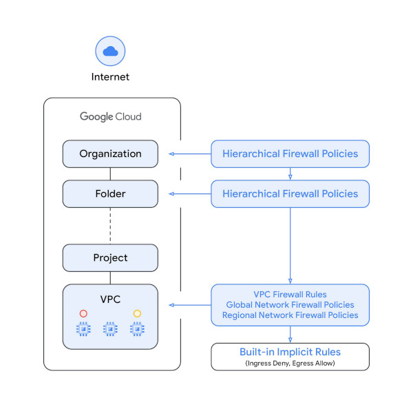

# GCE Firewall Rules

## Overview

The network security that firewalls provide is one of the basic building blocks for a secure cloud infrastructure. [Google Cloud Firewall](https://cloud.google.com/blog/products/identity-security/announcing-new-firewall-policies-and-iam-governed-tags) is a fully distributed, cloud-native stateful inspection firewall service that can be used to achieve a Zero Trust network for Google Compute Engine VMs (See also [GKE Firewall Rules](../gke-firewall-rules)).

New firewall policy and secure tag constructs will allow a simplified, more granular control of firewall policies with better scale. When combined with existing Hierarchical Firewall Policies, they can help create an environment that can be least-privileged in security posture, while also being self-service for teams throughout an organization.

Existing VPC Firewall Rules are still supported and can be used with Network Firewall Policies and Resource Manager Tags at the same time. However, customers are encoraged to migrate existing rules to policies and there will be migration tools to help automate the process.



#
## GCE VPC Firewall Rules

These firewall rules are created directly on a VPC and can use [network tags, ports, CIDR ranges, or service accounts](https://cloud.google.com/blog/products/gcp/three-ways-to-configure-robust-firewall-rules). The service accounts and network tags can not be referenced from a different VPC, so the only method of inter-VPC network traffic control is using IP addresses. Also VPC firewall rules need to be updated individually at each rule level, and no batch/atomic update is supported, leading to race conditions and operational challenges.

**Note:** All ingress or egress traffic, including traffic for [Alias IP ranges](https://cloud.google.com/vpc/docs/alias-ip#firewalls), is evaluated by a VPC firewall rule for a matching **target tag** or **target service account**. For details about targets and Alias IPs, see [Targets and IP addresses](https://cloud.google.com/vpc/docs/firewalls#targets_and_ips). But alias IP ranges are **not included** when you specify sources for an ingress firewall rule using **source tags** or **source service accounts**. Alias IP ranges for that NIC and IP addresses for associated forwarding rules are **not included** when using **source tags** or **source service accounts**. If you need to include the alias IP ranges of a VM's network interface, add the alias ranges using a source IPv4 range.

```bash
# https://cloud.google.com/iam/docs/creating-managing-service-accounts
gcloud iam service-accounts create test-sa --project=my-gce-project \
    --description="test service account" \
    --display-name="testing"

# https://cloud.google.com/sdk/gcloud/reference/compute/instances/create
gcloud compute instances create test-vm --project=my-gce-project \
  --zone=us-central1-c --machine-type=e2-custom-2-6400 \
  --network-interface "nic-type=GVNIC,network=my-vpc,subnet=gke-iowa-subnet,no-address" \
  --image-family=ubuntu-2204-lts --image-project=ubuntu-os-cloud \
  --boot-disk-size=10GB --boot-disk-type=pd-standard \
  --shielded-vtpm --shielded-integrity-monitoring --tags=instancetag1,instancetag2 \
  --service-account="test-sa@my-gce-project.iam.gserviceaccount.com"

# https://cloud.google.com/sdk/gcloud/reference/compute/firewall-rules/create
gcloud compute firewall-rules create allow-all --project=my-gce-project \
  --direction=INGRESS --action=allow --rules=tcp,udp,icmp,esp,ah,sctp \
  --source-ranges=1.2.3.4/32,10.0.10.0/24 --network=my-vpc

# Apply rule to network tags
gcloud compute firewall-rules create allow-ssh-rdp --project=my-gce-project \
  --direction=INGRESS --action=allow --rules=tcp:22,tcp:3389,icmp \
  --target-tags="bastion,ssh,rdp,ssh-rdp" --network=my-vpc

# Enable firewall rule so IAP can connect via SSH https://cloud.google.com/iap/docs/using-tcp-forwarding
gcloud compute firewall-rules create allow-ssh-ingress-from-iap \
  --project=my-gce-project --direction=INGRESS --action=allow \
  --rules=tcp:22 --source-ranges=35.235.240.0/20 --network=my-vpc
```

#
## GCE Network Firewall Policies

[Network firewall policies](https://cloud.google.com/blog/products/identity-security/announcing-new-firewall-policies-and-iam-governed-tags) acts as a container for firewall rules and are enforced when the policy is associated with a VPC network (globally or in a specific region), enabling simultaneous batch updates to multiple rules in the same policy.

The same Network Firewall Policy can be associated with more than one VPC network, and each VPC network can only have one Global Network Firewall Policy, and one Regional Firewall Policy per region associated with it. Both global and regional policies support secure IAM-governed tags, and all Cloud Firewall enhancements moving forward will be delivered on the new Network Firewall Policy constructs.

```bash
# https://cloud.google.com/sdk/gcloud/reference/compute/network-firewall-policies/rules/create
gcloud compute network-firewall-policies create my-global-policy --description="test global policy" --global
gcloud compute network-firewall-policies rules create 10 --firewall-policy=my-global-policy \
  --action=allow --direction=INGRESS --description="example global IAP SSH and RDP rule" --global-firewall-policy \
  --layer4-configs="tcp:22,tcp:3389" --src-ip-ranges=35.235.240.0/20
gcloud compute network-firewall-policies associations create --firewall-policy=my-global-policy \
  --network=my-vpc --name=my-global-association --global-firewall-policy

# Create a regional policy
gcloud compute network-firewall-policies create my-iowa-policy --description="test iowa policy" --region=us-central1
gcloud compute network-firewall-policies rules create 10 --firewall-policy=my-iowa-policy \
  --action=allow --direction=EGRESS --description="example regional rule" --firewall-policy-region=us-central1 \
  --layer4-configs="tcp:9999,udp:9998,icmp" --dest-ip-ranges="10.2.1.0/24" \
  --target-service-accounts "501234567890-compute@developer.gserviceaccount.com,test-sa@my-gce-project.iam.gserviceaccount.com"
gcloud compute network-firewall-policies associations create --firewall-policy=my-iowa-policy \
  --network=my-vpc --name=my-iowa-association --firewall-policy-region=us-central1
```

#
## Resource Manager Tags (Secure IAM Tags)

Resource Manager tags is a new type of tag resource with enhanced security properties that can be applied to various Google Cloud resources, including VM instances. The new Network Firewall Policy structures are built to easily [integrate with Secure IAM Tags](https://cloud.google.com/vpc/docs/tags-firewalls-overview) as a mechanism for enabling micro-segmentation while restricting which users are allowed to modify tags and which users are allowed to bind individual tags.

For example, the assignment of VMs to logical names could be delegated using fine-grained IAM controls to other teams in the organization such as app developers, database administrators, or operations teams. Unlike the Network Tags that are mapped only to the primary IP address of a VM, the new Tags in Network Firewall Policies support both primary and alias IP range mapping. Tags replace Network Tags as the recommended, best-practice tagging mechanism in defining firewall rules for VM instances.

Attaching tags to VMs: Each tag can be attached to an unlimited number of VM instances. You can attach a maximum of 10 tags per VPC used by each VM.

```bash
# View organization list: gcloud organizations list
ORGID=10123456789
PROJECT=50123456789

# Secure Tags https://cloud.google.com/resource-manager/docs/tags/tags-creating-and-managing
gcloud organizations add-iam-policy-binding $ORGID \
 --member="user:admin@example.com" \
 --role="roles/resourcemanager.tagAdmin"
gcloud resource-manager tags keys create production --parent=organizations/$ORGID \
  --description="Production Servers" --purpose GCE_FIREWALL \
  --purpose-data="network=$PROJECT/my-vpc"
# IAM policy tag https://cloud.google.com/resource-manager/docs/organization-policy/tags-organization-policy
gcloud resource-manager tags keys create prod-iam --parent=organizations/$ORGID \
  --description="Production IAM"

# Add different values to the keys
gcloud resource-manager tags values create web --parent $ORGID/production
gcloud resource-manager tags values create database --parent $ORGID/production
gcloud resource-manager tags values create allow-public-ip --parent $ORGID/prod-iam

# View via gcloud or console at https://console.cloud.google.com/iam-admin/tags?orgonly=true
gcloud resource-manager tags keys list --parent=organizations/$ORGID
gcloud resource-manager tags keys describe $ORGID/production
# Find tagValues (can be used when binding)
gcloud resource-manager tags values list --parent=$ORGID/production


# https://cloud.google.com/resource-manager/docs/tags/tags-creating-and-managing#required-permissions-attach
gcloud resource-manager tags values add-iam-policy-binding $ORGID/production/web \
 --member="user:admin@example.com" \
 --role="roles/resourcemanager.tagUser"
gcloud resource-manager tags values add-iam-policy-binding $ORGID/production/database \
 --member="user:admin@example.com" \
 --role="roles/resourcemanager.tagUser"

# https://cloud.google.com/resource-manager/docs/tags/tags-creating-and-managing#attaching
gcloud resource-manager tags bindings create --location us-central1-c \
  --parent "//compute.googleapis.com/projects/$PROJECT/zones/us-central1-c/instances/test-vm" \
  --tag-value $ORGID/production/web

# Some services support using IAM Policy Tags
# See https://cloud.google.com/resource-manager/docs/tags/tags-supported-services

# Bind IAM Policy Tag to a project and supported services will inherit it
gcloud resource-manager tags bindings create \
    --parent=//cloudresourcemanager.googleapis.com/projects/$PROJECT \
    --tag-value=$ORGID/prod-iam/allow-public-ip
    
# IAM Policy tags for GKE https://cloud.google.com/kubernetes-engine/docs/how-to/tags#attach-tag-cluster
gcloud resource-manager tags bindings create \
    --tag-value=$ORGID/prod-iam/allow-public-ip \
    --parent=//container.googleapis.com/projects/$PROJECT/locations/us-central1/clusters/my-gke-cluster \
    --location=us-central1

# GKE and MIG do not yet natively support GCE_FIREWALL tags. They can be applied manually using
# individual VMs using gcloud/SDK/REST API calls, but since they don't get applied automatically
# when nodes are created it is not recommended to use Resource Manager Tags for GKE Firewall rules right now.

# Resource Manager Tags are not visible in the console yet, but can view bindings using
gcloud resource-manager tags bindings list --location us-central1-c --effective \
  --parent "//compute.googleapis.com/projects/$PROJECT/zones/us-central1-c/instances/test-vm"
```

#
## Hierarchical Firewall Rules

[Hierarchical Firewall Policies](https://cloud.google.com/blog/products/identity-security/new-google-cloud-hierarchical-firewall-policies) can apply policies at the organization and folder levels (targeting VPCs or Service Accounts) with strict IAM permissions and evaluation priority rules. This allows security administrators at different levels in the hierarchy to define and deploy consistent firewall rules across a number of projects so that they are applied to all VMs in currently existing and yet-to-be-created projects.

Hierarchical firewalls are still enforced at the VM level like all other firewall rules but are evaluated before VPC firewalls; you could think of it as a set of rule chains that get evaluated in sequence according to the GCP resource hierarchy level at which each rule chain is applied. So based on that, rules applied at the organization level have a higher priority than child folders or rules applied to lower levels in the hierarchy. If a firewall rule within a firewall policy matches, the action is taken and firewall policies at lower levels in the hierarchy (including VPC firewalls) are ignored unless the rule action is "go to next".

```bash
# Setup organization (or delegated project) permissions https://cloud.google.com/vpc/docs/firewall-policies#iam
gcloud organizations add-iam-policy-binding $ORGID \
 --member="user:admin@example.com" \
 --role="roles/compute.orgSecurityResourceAdmin"

# https://cloud.google.com/sdk/gcloud/reference/compute/firewall-policies/create
gcloud compute firewall-policies create --short-name=my-org-policy --organization=$ORGID
gcloud compute firewall-policies rules create 1000 \
    --action=allow \
    --description="allow-scan-probe" \
    --layer4-configs=tcp:123 \
    --firewall-policy=my-org-policy \
    --organization=$ORGID \
    --src-ip-ranges=10.100.0.1/32
gcloud compute firewall-policies associations create \
    --firewall-policy=my-org-policy --organization=$ORGID

# gcloud resource-manager folders list --organization=$ORGID
$FOLDER=40123456789
gcloud compute firewall-policies create --short-name=my-folder-policy --folder=$FOLDER
gcloud compute firewall-policies rules create 2000 \
    --action=allow \
    --description="allow-folder-probe" \
    --layer4-configs=tcp:123 \
    --firewall-policy=my-folder-policy \
    --organization=$ORGID \
    --src-ip-ranges=10.150.0.1/32
gcloud compute firewall-policies associations create \
    --firewall-policy=my-folder-policy --folder=$FOLDER --organization=$ORGID
```

#
## View policies and rules

View hierarchical associated policies at the top and VPC policies at the bottom of the VPC -> Firewall section of the [Google Cloud console](https://console.cloud.google.com/networking/firewalls/list). You can also use gcloud to list policies and effective rules.

```bash
gcloud compute firewall-policies list --organization=$ORGID  # Hierarchial Firewall Rules
gcloud compute network-firewall-policies list              # Network Firewall Policies
gcloud compute firewall-rules list                         # VPC Firewall Rules

# https://cloud.google.com/vpc/docs/firewalls
gcloud compute instances network-interfaces get-effective-firewalls test-vm --zone us-central1-c
TYPE              FIREWALL_POLICY_NAME  PRIORITY  ACTION  DIRECTION  IP_RANGES
network-firewall                        1000      ALLOW   INGRESS    130.211.0.0/22,35.191.0.0/16
network-firewall                        1000      ALLOW   INGRESS    130.211.0.0/22,35.191.0.0/16
network-firewall                        1000      ALLOW   INGRESS
network-firewall                        1000      ALLOW   INGRESS    35.235.240.0/20,10.0.0.0/16
network-firewall                        1000      ALLOW   INGRESS    35.235.240.0/20

gcloud compute network-firewall-policies get-effective-firewalls --network=my-vpc --region=us-central1
gcloud compute networks get-effective-firewalls my-vpc
```
